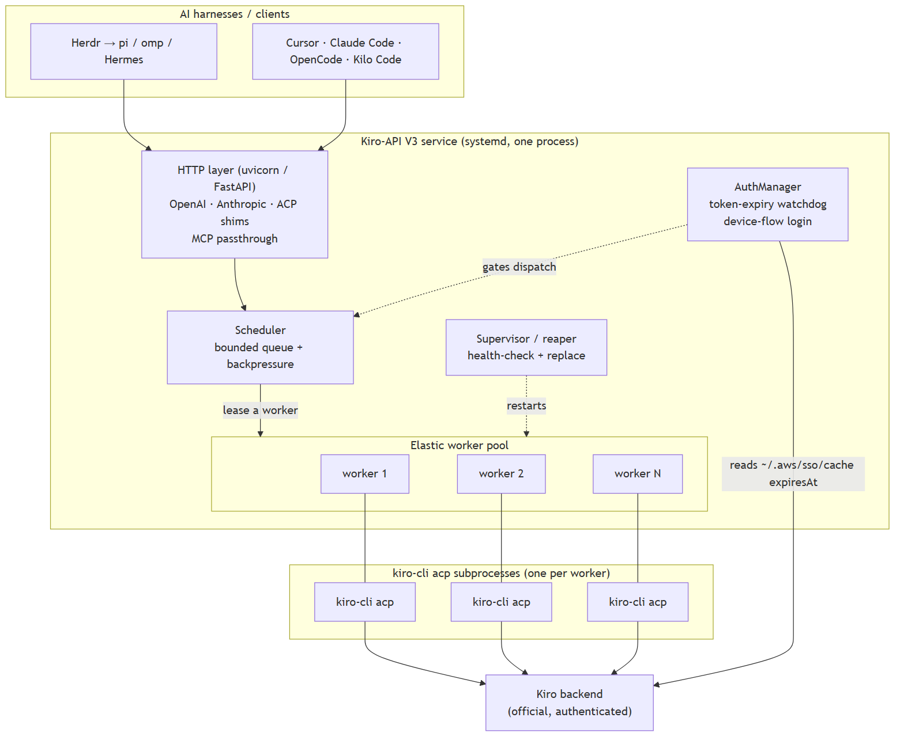

# Kiro-API V3

**Use your Kiro subscription from the AI tools you already use.** Kiro-API V3 is a
small Linux service that turns the official **Kiro CLI** into OpenAI-, Anthropic-,
and ACP-compatible HTTP endpoints — so any compatible harness (Herdr driving
pi/omp/Hermes, Cursor, Claude Code, OpenCode, Kilo Code, …) can use Kiro as its
model.



<sub>Your AI tools → Kiro-API V3 (a pool of `kiro-cli` workers) → the Kiro backend, all via the official CLI.</sub>

## What it's for

You have a Kiro login and tools that speak OpenAI/Anthropic. This service is the
bridge — one local endpoint, your existing subscription, no credential juggling.
It's built to run **many agents at once** (≈10 typical, up to ~100 for stress
tests) as a reliable, always-on service.

## What it can do

- **Speaks three protocols** on one endpoint: OpenAI (`/v1/chat/completions`,
  `/v1/responses`, `/v1/models`), Anthropic (`/v1/messages`), and native **ACP**.
- **Real streaming** with reasoning and tool-activity surfaced, plus keepalives so
  long tool calls don't time out.
- **MCP passthrough** — your harness's MCP servers are forwarded to Kiro CLI.
- **Runs many agents in parallel** via an elastic pool of `kiro-cli` workers.
- **Self-healing auth** — it refreshes your token *before* it expires, so it never
  gets stuck on a stale login; if logged out it stays up and recovers on re-login.
- **A real service** — installs under systemd with auto-restart and a watchdog;
  configurable host/port that never crash-loops on a bad value.

## Quick start

```bash
pip install -e .                 # installs the `kiro-api` command
kiro-api login                   # sign in to Kiro (device flow)
kiro-api install-service --user  # run it as a background service
```

Then point your tool at `http://localhost:8787/v1` (OpenAI) or
`http://localhost:8787` (Anthropic), model `auto`. Full walkthrough:
**[User Guide](docs/USER-GUIDE.md)**.

## Commands

| Command | What it does |
|---------|--------------|
| `kiro-api serve` | Run the HTTP service (`-H` host, `-p` port, `--workers N`). |
| `kiro-api login` | Sign in to Kiro (device flow; opens your browser). |
| `kiro-api status` | Colored health dot + auth/pool/endpoints. |
| `kiro-api stats [--json]` | Metrics for scripting. |
| `kiro-api config` | Show effective configuration. |
| `kiro-api models` | List available models. |
| `kiro-api install-service [--user]` | Install/enable the systemd service. |
| `kiro-api acp` | Run as an ACP stdio agent for ACP-native editors. |
| `kiro-api version` | Versions. |

`kiro-api --help` (and `--help` on any command) shows all options.

## Status at a glance

| Dot | Meaning |
|-----|---------|
| 🟢 GREEN | online and healthy |
| 🟡 YELLOW | up but not logged in → `kiro-api login` |
| 🟠 ORANGE | up but at capacity |
| 🔴 RED | not reachable |

## Documentation

- **[User Guide](docs/USER-GUIDE.md)** — install, log in, wire up your tools, troubleshoot.
- **[Architecture](docs/ARCHITECTURE.md)** — how it works, the concurrency model, what it solves and its limits, with diagrams.
- **[Configuration & API Reference](docs/CONFIGURATION.md)** — every setting and endpoint.
- **[Dependencies](docs/DEPENDENCIES.md)** — what it needs.
- **[V3 Design](docs/V3-DESIGN.md)** — the design record.

## Requirements

Python 3.11+, a Linux host (for the service), and the official **Kiro CLI**
installed and logged in. Three runtime dependencies (`fastapi`, `uvicorn`,
`pydantic`). See [Dependencies](docs/DEPENDENCIES.md).

## Compliance

Talks to Kiro **only** through the official `kiro-cli` binary — no private
endpoints, no account pooling, no credential handling. Your use of Kiro CLI is
governed by its own license.
