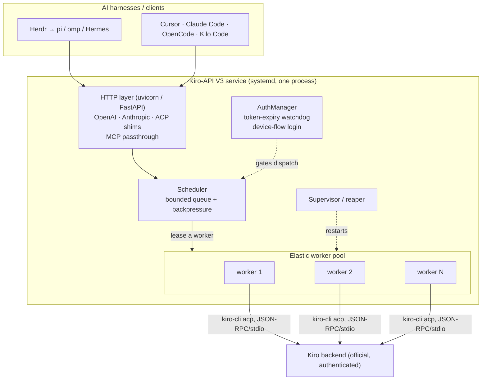
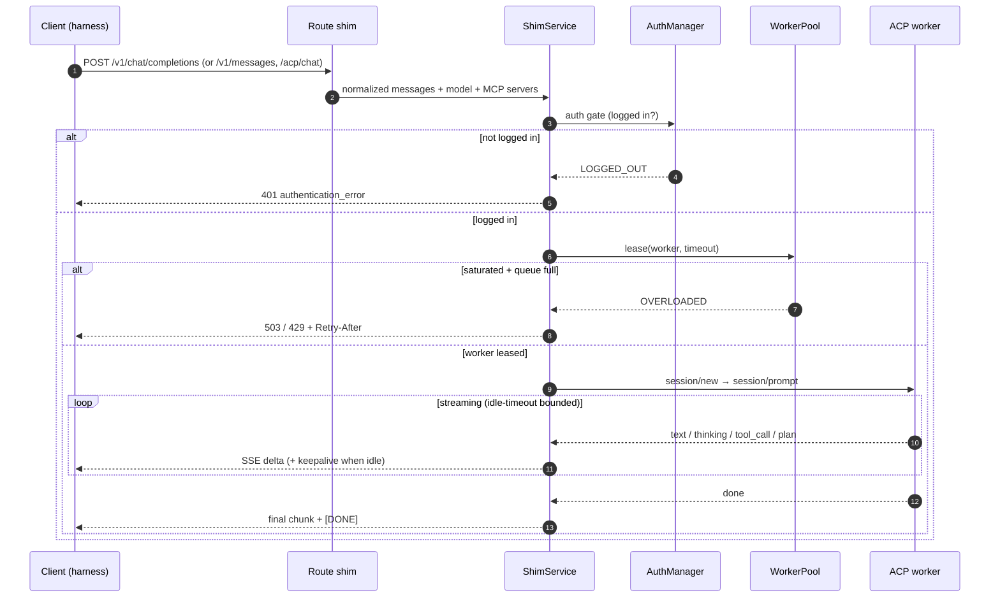
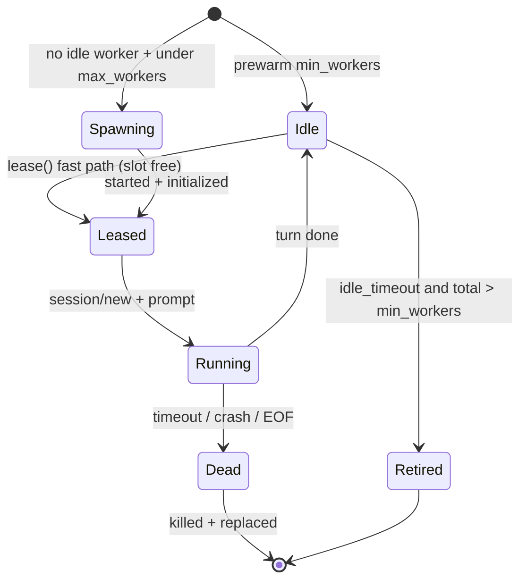
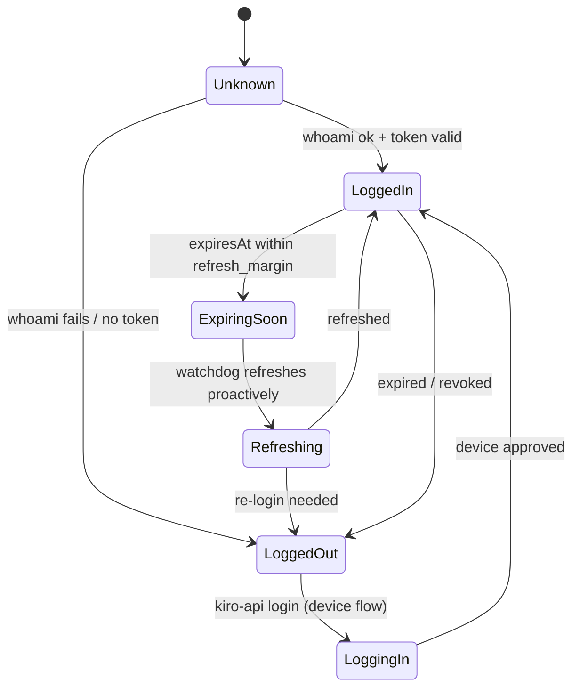

# Architecture

This document explains how Kiro-API V3 works end to end: the components, the
request lifecycle, the concurrency model, the self-healing auth design, the
reliability guarantees, and the known limitations. It is the reference for
anyone extending or operating the service.

- [What problem this solves](#what-problem-this-solves)
- [System overview](#system-overview)
- [The core design decision](#the-core-design-decision-a-pool-of-acp-workers)
- [Components](#components)
- [Request lifecycle](#request-lifecycle)
- [Concurrency model](#concurrency-model)
- [Self-healing authentication](#self-healing-authentication)
- [Reliability guarantees](#reliability-guarantees)
- [Protocol translation](#protocol-translation)
- [What it enables](#what-it-enables)
- [Limitations](#limitations)
- [Compliance](#compliance)

---

## What problem this solves

Kiro is an AI coding backend you authenticate to with the official **Kiro CLI**
(`kiro-cli`). Many agent harnesses — Herdr orchestrating pi/omp/Hermes, plus
Cursor, Claude Code, OpenCode, Kilo Code — speak the **OpenAI** or **Anthropic**
HTTP APIs, not `kiro-cli`. Kiro-API V3 is the bridge: it presents those HTTP
APIs (and native ACP) on one local endpoint and drives `kiro-cli` underneath.

Two properties make it more than a thin proxy, and both come from real pain
points in the previous version (V2):

1. **It must run many agents in parallel** — ~10 concurrently in normal use,
   scalable to ~100 for stress testing — *with* real incremental streaming.
2. **It must never get stuck.** V2's worst failures were stuck states: a running
   service holding an **expired token**, or a crashed component wedging the whole
   thing. V3 treats every long-lived resource as a supervised state machine with
   a detector and a recovery.

---

## System overview

The whole service is a **single Python process** (one `uvicorn` event loop)
supervised by systemd. It spawns N `kiro-cli acp` **subprocesses** — the worker
pool — which do the actual work against Kiro.

---

## The core design decision: a pool of ACP workers

There is a fundamental tension between two requirements:

- **Real incremental streaming** (token deltas, reasoning, tool events, MCP)
  requires the **ACP interface**: a long-lived `kiro-cli acp` process speaking
  JSON-RPC 2.0 over stdio. A one-shot `kiro-cli chat` call only returns a whole
  response, so it cannot stream.
- **~100 parallel agents** cannot share a *single* long-lived process: one stdio
  pipe plus one write lock serializes everything, and if that one process stalls,
  every session fails at once. (This is the structural ceiling of a
  single-subprocess gateway.)

**V3's answer is an elastic pool of long-lived ACP workers.** Each worker is one
`kiro-cli acp` subprocess (so you get streaming); the pool runs many of them (so
you get true OS-level parallelism). A worker handles **one active turn at a
time**, so a heavy turn can only block itself, never its neighbours.

This is the combination neither a process-per-request design (no streaming) nor a
single-subprocess design (no parallelism) can offer on its own.

---

## Components

| Module | Responsibility |
|--------|----------------|
| `kiro_api/cli.py` | Command-line entrypoint and subcommands (`serve`, `login`, `status`, …). |
| `kiro_api/server.py` | Assembles the FastAPI app; `serve()` validates the bind, starts the pool + auth watchdog, wires systemd notify/watchdog, and coordinates graceful shutdown. |
| `kiro_api/config.py` | Config with precedence **CLI > env > file > defaults**, plus `validate_bind()` (fail loud before startup). |
| `kiro_api/auth.py` | `AuthManager` — the single authoritative auth actor: discovery, expiry watchdog, proactive refresh, device-flow login. |
| `kiro_api/acp/client.py` | `ACPWorker` — one `kiro-cli acp` subprocess: JSON-RPC handshake, per-turn session, normalized event stream, cancel, liveness. |
| `kiro_api/pool.py` | `WorkerPool` — elastic pool + scheduler + bounded queue + idle sweep. |
| `kiro_api/service.py` | `ShimService` — per-turn orchestration (auth gate → lease → session → stream). |
| `kiro_api/streaming.py` | SSE builders for OpenAI/Anthropic + keepalive heartbeats. |
| `kiro_api/routes/` | Protocol route shims: `openai`, `anthropic`, `acp`, `control` (`/health`, `/ready`, `/stats`), `admin` (login). |
| `kiro_api/errors.py` | Error taxonomy → native OpenAI/Anthropic error envelopes. |
| `kiro_api/install.py` | systemd unit installer (`Type=notify`, watchdog, restart). |
| `kiro_api/sdnotify.py` | Minimal `sd_notify` (readiness + watchdog), no external dependency. |
| `kiro_api/tray/` | Optional **read-only** tray companion (status dot + copy endpoints). |

---

## Request lifecycle

Every turn: **auth gate** (fail fast with a native `401` if not logged in) →
**lease a worker** (bounded wait; `503`/`429` if the pool is saturated and the
queue is full) → open a fresh ACP **session** (register any MCP servers, optionally
set the model) → **stream** normalized events, translated to the caller's protocol,
with keepalives during silence → **done**, worker returned to the pool.

---

## Concurrency model

- **Elastic sizing.** Workers are spawned lazily on demand up to `max_workers`
  and retired after `worker_idle_timeout` down to `min_workers`. So ~10 agents
  run a handful of workers, while a stress test with `--workers 100` grows the
  pool to match. `max_workers` is the concurrency ceiling.
- **One turn per worker.** True parallelism comes from running many workers, not
  from multiplexing one — this is what keeps a slow/heavy turn from blocking
  others.
- **Backpressure.** A bounded queue (`max_queue`) guards the pool. A lease first
  tries to grab a free slot immediately; only when the pool is saturated does the
  request queue, and only up to `max_queue` waiters. Beyond that it is rejected
  with a native `503`/`429` + `Retry-After`, so the service degrades gracefully
  instead of collapsing.
- **The real ceiling is Kiro's account rate limit.** Even at 100 workers,
  throughput is ultimately bounded by the single Kiro account's server-side rate
  limits. The service surfaces upstream `429`s natively rather than pretending to
  have infinite capacity.

Validated in testing: 100 live workers spawned simultaneously (100+ real child
processes confirmed via `/proc`), all reaped to zero on shutdown; queue
saturation rejects cleanly; a worker killed mid-turn does not affect concurrent
healthy turns.

---

## Self-healing authentication

The `AuthManager` is the **single authoritative auth actor** and the only
component that triggers a refresh or login, so the shared single-account
credential cache is touched by exactly one owner.

- **Discovery.** It locates the active token across standard locations
  (`$KIRO_CONFIG_DIR`, `~/.kiro`, `~/.aws/sso/cache`, `~/.aws/login/cache`),
  reading only non-secret metadata — the `expiresAt` timestamp — never token
  values. AWS IAM Identity Center caches its bearer token as JSON here with an
  `expiresAt` field ([AWS SDK docs](https://docs.aws.amazon.com/sdkref/latest/guide/feature-sso-credentials.html)).
- **Two-signal liveness.** A cheap local read of the earliest `expiresAt`, plus
  an authoritative `kiro-cli whoami` probe (short timeout, cached).
- **Proactive refresh.** When `expiresAt` is within `auth_refresh_margin`
  (default 300s), the watchdog refreshes **before** any worker uses a stale token
  — the direct fix for V2's "stuck on an expired token" failure. IAM Identity
  Center supports automatic refresh via the refresh token
  ([session expiration & refresh](https://docs.aws.amazon.com/sdkref/latest/guide/understanding-sso.html));
  the legacy config is a fixed ~8h session that requires an explicit re-login.
- **Never crashes on logout.** If the session cannot be renewed, the service
  stays up, reports `LOGGED_OUT` (tray goes yellow), returns clean `401`s, and
  recovers automatically the moment a valid token reappears.

Login uses the official device flow — `kiro-cli login --use-device-flow` — which
prints a verification URL and code, works headless/over SSH, and optionally opens
the URL in a browser when a desktop session is present. This is the same flow AWS
documents for signing in to Kiro CLI
([SageMaker Unified Studio: sign in and start Kiro CLI](https://docs.aws.amazon.com/sagemaker-unified-studio/latest/userguide/q-actions.html)).
*(Content rephrased for compliance with licensing restrictions.)*

---

## Reliability guarantees

- **Nothing hangs forever.** Every turn is bounded by an **idle timeout** (max
  seconds between events, reset per event) and an optional **hard turn timeout**.
  A silent or wedged worker produces a clean `timeout` error and is retired — the
  request never hangs indefinitely.
- **Dead workers are replaced.** A worker that crashes, hits EOF, or times out is
  marked dead immediately (not waiting for the OS to reap it), killed by process
  group, and replaced. One bad worker never wedges the pool.
- **Bind safety.** `serve` validates the host/port **before** starting the pool.
  A bad or in-use address exits with a clear non-zero code — never a half-started
  zombie. Any IP (localhost, LAN, `0.0.0.0`) and any port are allowed.
- **Graceful drain.** On `SIGTERM` a single coordinated handler stops accepting,
  drains in-flight work, and kills all worker subprocesses — leaving **zero
  orphaned processes** (verified).
- **systemd watchdog.** The service runs as `Type=notify`, signals readiness, and
  pets the watchdog; if the event loop wedges, systemd restarts it. `Restart=on-failure`
  covers crashes; `TasksMax` is sized for the worker pool.
- **Health vs readiness.** `/health` = process alive; `/ready` = logged in **and**
  a worker is available. Monitors can tell "up" from "serving".

---

## Protocol translation

The service is protocol-agnostic internally: routes translate each API into a
normalized message list and translate a normalized event stream back out.

- **Prompt building.** ACP's `session/prompt` is a role-less content block, and
  the service is stateless (fresh session per request), so a multi-turn
  conversation is serialized into a single labelled transcript
  (`System:` / `Developer:` / `User:` / `Assistant:`) preserving order. A lone
  user message is sent verbatim.
- **Streaming.** Normalized `text` / `thinking` / `tool_call` / `plan` / `done`
  events are mapped to each protocol's native SSE shape. Reasoning and tool
  activity are surfaced additively and never change the final answer. **Keepalive
  frames** are emitted during upstream silence so client idle-watchdogs don't
  abort a long tool call.
- **MCP passthrough.** MCP servers a harness declares (via the
  `X-Kiro-MCP-Servers` header or an `mcp_servers` body field) are forwarded to
  `kiro-cli` on `session/new`. The gateway never executes MCP tools itself —
  `kiro-cli` does.
- **Native errors.** Upstream failures are classified (rate limit / overloaded /
  timeout / auth / other) and returned in each API's native error envelope with
  the correct HTTP status and a `Retry-After` when applicable, so harness
  retry/back-off logic behaves correctly.

---

## What it enables

- Point **any** OpenAI- or Anthropic-compatible harness at one local endpoint and
  have it use your Kiro subscription.
- Run a fleet of agents in parallel (Herdr + pi/omp/Hermes) against a single Kiro
  account, with real streaming and reasoning/tool visibility.
- Native ACP clients can talk to it directly, or launch it as an ACP stdio agent.
- Operate it as a proper long-running Linux service with logs, health checks, and
  auto-restart — suitable for semi-production development workloads.

---

## Limitations

- **Single account, many workers.** V3 uses one Kiro/AWS login shared read-only
  across all workers, with a single refresh actor. It does **not** pool accounts.
  Kiro's backend associates a session with an OIDC client registration; running
  many concurrent `kiro-cli acp` workers off one login is the intended model here,
  but the exact concurrency behaviour of one account should be validated against a
  real binary under load (see the smoke-test note in the user guide).
- **The ACP wire format is an evolving surface.** `kiro-cli login`/`chat` are
  documented by AWS, but the `kiro-cli acp` JSON-RPC surface is not yet in
  official public docs; V3's ACP client follows the ACP/Zed protocol as
  implemented by `kiro-cli` and cross-checked against the kiro-gateway project. It
  is pinned to `--agent-engine v2` (the v3 engine needs host-mediated auth V3 does
  not implement).
- **Token usage is estimated.** `kiro-cli` does not report token counts over ACP
  today, so usage is a heuristic (~4 chars/token). The code surfaces real counts
  automatically if a future `kiro-cli` provides them.
- **Throughput is bounded by the Kiro account's rate limits**, not by the worker
  count — 100 workers do not grant 100× the account's server-side quota.
- **Linux only.** systemd integration targets Linux; macOS/launchd is out of scope.

---

## Compliance

Kiro-API V3 talks to Kiro **only** through the official `kiro-cli` binary. It
never calls private Kiro endpoints, never pools or multiplexes accounts, and
never handles credentials directly — all authentication lives inside `kiro-cli`.
This reflects the project's design intent, not legal advice; your use of Kiro CLI
is governed by its own license terms.
