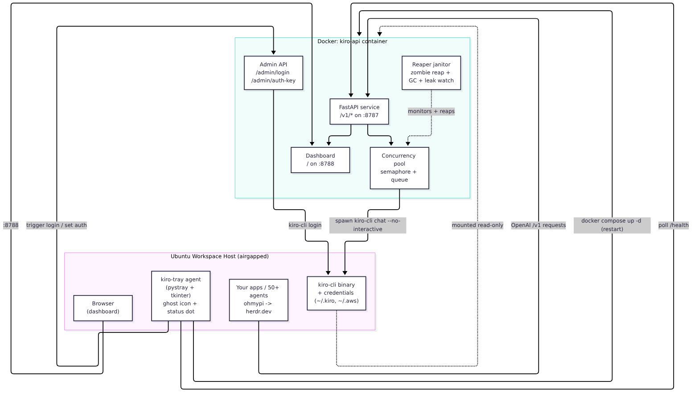
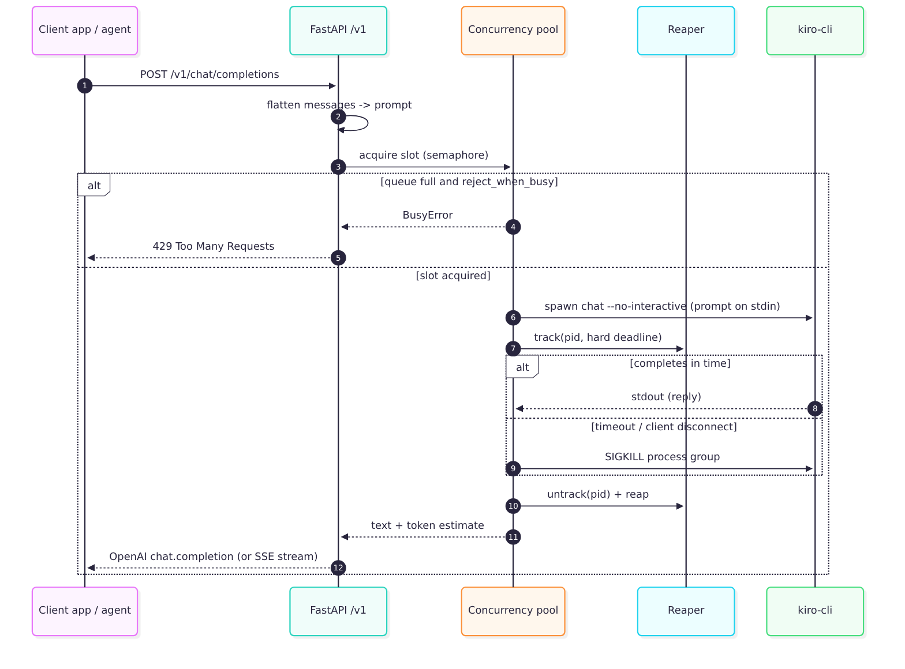
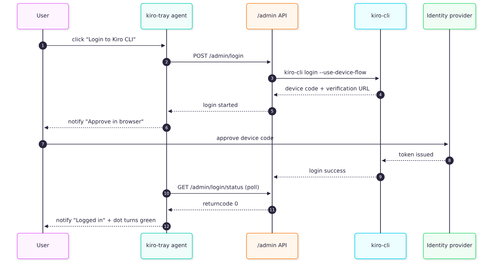
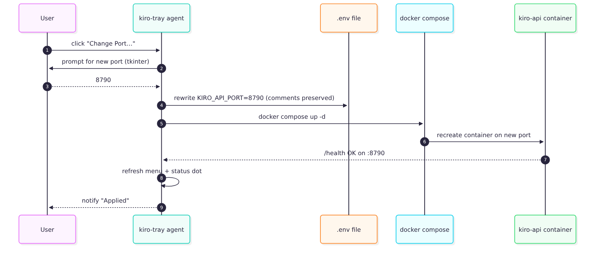

# Architecture & Workflows

Kiro-API V2 is two cooperating pieces: a **containerized API + dashboard**, and a
**host-side tray agent**. This split exists because a Docker container cannot draw
a Linux system-tray icon — that needs host D-Bus / AppIndicator access — so the
tray lives on the host and controls the container.

## System architecture

| Component | Where | Role |
|-----------|-------|------|
| FastAPI service | container | OpenAI `/v1` endpoints on `:8787` |
| Dashboard | container | Live status page on `:8788` |
| Concurrency pool | container | Bounds simultaneous `kiro-cli` jobs |
| Reaper janitor | container | Reaps processes, watches for leaks, runs GC |
| Admin API | container | Login trigger + auth-key toggle for the tray |
| kiro-tray agent | host | Ghost tray icon, status dot, control menu |
| kiro-cli + creds | host | Mounted read-only into the container |

The container binds `0.0.0.0` internally, but compose publishes the ports on
`127.0.0.1` only, so nothing is exposed off-host.

## Request flow

Every API call becomes one short-lived `kiro-cli chat --no-interactive` job.
A semaphore bounds concurrency; extra requests queue (or get a 429 if
`reject_when_busy` is on). The reaper guarantees no job can hold a slot forever.

Key properties:
- Large prompts go to the CLI via **stdin** (no argv length limits).
- On timeout or client disconnect, the whole **process group is SIGKILLed** so
  the concurrency slot frees immediately.
- Streaming (`stream: true`) returns SSE chunks: a role delta, the content, a
  final chunk with `usage`, then `[DONE]`.
- Token counts are estimates (~4 chars/token) until kiro-cli exposes real usage.

## Concurrency model (50+ agents)

Tuned for the ohmypi → herdr.dev workload where many agents share one endpoint:

| Setting | Env var | Default | Purpose |
|---------|---------|---------|---------|
| Max parallel jobs | `KIRO_API_MAX_CONCURRENCY` | 8 | Hard ceiling on `kiro-cli` processes |
| Queue depth | `KIRO_API_MAX_QUEUE` | 0 (unlimited) | Backpressure threshold |
| Reject when busy | `KIRO_API_REJECT_WHEN_BUSY` | false | 429 instead of queueing |
| Short timeout | `KIRO_API_TIMEOUT_SHORT` | 120s | Default request tier |
| Long timeout | `KIRO_API_TIMEOUT_LONG` | 900s | Tool calls (Jira/GitLab), big analysis |

A request is treated as **long-running** if it sends header `X-Kiro-Long: 1` or
uses a model whose name contains `long`. Start conservative on the real box and
raise `MAX_CONCURRENCY` while watching the dashboard's active/queue depth and the
reaper's child-process count — that tells you what kiro-cli actually tolerates.

## Long-run resource hygiene

For a service running for weeks, the reaper (`app/reaper.py`) runs a background
janitor that:

1. **Reaps zombies** every 15s via non-blocking `waitpid`.
2. **Enforces a hard deadline** — kills any job past `timeout + 60s` (a backstop
   in case a normal kill was missed), so a wedged job can never starve the pool.
3. **Watches child-process count** via `/proc`; if it exceeds
   `max_concurrency * 2 + 8`, it raises a leak warning (dashboard dot → orange).
4. **Runs `gc.collect()` + glibc `malloc_trim(0)`** every 5 min to return freed
   heap to the OS.

Belt-and-braces at the container level: `init: true` (a real init reaps any
stray children) and `pids: 512` (a hard fork-storm ceiling).

## Lifecycle & clean shutdown

`docker stop` / `docker compose down` must leave nothing behind so the next
start is clean. The shutdown path (verified with `scripts/test_shutdown.sh`):

1. Docker sends `SIGTERM` (via tini as PID 1).
2. The entrypoint installs **one** signal handler — uvicorn's own per-server
   handlers are disabled — so both the API and dashboard servers are told to
   exit together instead of racing.
3. On the way out, `reaper.kill_all_jobs()` SIGKILLs every in-flight
   `kiro-cli` process group, so no job is orphaned.
4. The process exits 0 within the `stop_grace_period` (20s); if anything
   wedged, Docker's cgroup teardown kills all remaining processes anyway.

Result: no ghost `kiro-cli` processes survive a stop, and a subsequent
`docker compose up -d` starts fresh. The test confirms 5 in-flight jobs → 0
surviving host processes after stop, exit code 0, and green health after
restart.

### .env is the persistence layer

Compose provides a default for every setting, so the stack runs with no `.env`.
The file exists to persist (a) per-machine host paths and (b) values the tray
changes at runtime (port, address, auth key), so those survive restarts. Tuning
defaults live inline in the compose files; `.env` only overrides them if you
uncomment a line.

## Login flow

The tray's **Login to Kiro CLI** button asks the container to run
`kiro-cli login --use-device-flow` against the mounted credentials, so login and
serving use the exact same CLI + config. If the container isn't reachable, it
falls back to opening `kiro-cli login` in a host terminal.

## Port / address change flow

Per the design decision that a sub-second restart is acceptable, the tray applies
port/address changes by rewriting `.env` and running `docker compose up -d`. No
manual file editing. (uvicorn cannot cleanly rebind its listen port in-process,
so an in-place hot-rebind would be fragile.)

## Deployment (airgapped)

See [DEPLOYMENT.md](DEPLOYMENT.md) for step-by-step instructions and
[DEPENDENCIES.md](DEPENDENCIES.md) for the exact artifacts to stage.

## Status dot logic

| Dot | Condition |
|-----|-----------|
| 🔴 Red | `/health` unreachable (API not running) |
| 🟡 Yellow | Reachable but `logged_in: false` |
| 🟠 Orange | Leak warning or pool errors (check dashboard) |
| 🟢 Green | Logged in, no errors, no leak |
