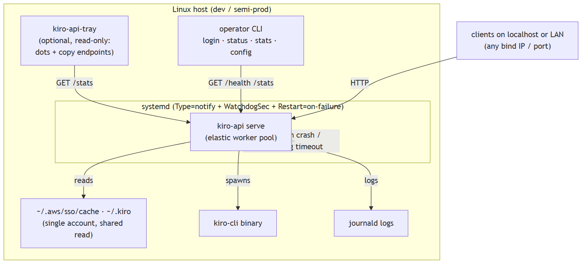

# User Guide

Get Kiro-API V3 running and pointed at your AI tools in a few minutes. Written
for a semi-technical user — copy/paste the commands.

- [Prerequisites](#prerequisites)
- [Install](#install)
- [Log in to Kiro](#log-in-to-kiro)
- [Run it](#run-it)
- [Run it as a service (recommended)](#run-it-as-a-service-recommended)
- [Point your AI tool at it](#point-your-ai-tool-at-it)
- [Check it's healthy](#check-its-healthy)
- [Change host / port](#change-host--port)
- [Scale up for many agents](#scale-up-for-many-agents)
- [The tray companion (optional)](#the-tray-companion-optional)
- [Troubleshooting](#troubleshooting)
- [Validate against a real kiro-cli](#validate-against-a-real-kiro-cli)

---

## Prerequisites

- **Linux** (systemd for the service; runs directly anywhere Python does).
- **Python 3.11+**.
- **Kiro CLI** installed and on your `$PATH`. Install it from
  [kiro.dev](https://kiro.dev), then verify: `kiro-cli --version`.

---

## Install

```bash
git clone <your-repo-url> kiro-api
cd kiro-api
python3 -m venv .venv
. .venv/bin/activate
pip install -e .
```

That installs the `kiro-api` command. (For the optional tray, use
`pip install -e ".[tray]"`; for development, `pip install -e ".[dev]"`.)

---

## Log in to Kiro

You authenticate once with the official device flow. Either run the Kiro CLI
directly:

```bash
kiro-cli login --use-device-flow
```

…or use the wrapper, which prints the URL/code and opens your browser if you have
a desktop session:

```bash
kiro-api login
```

Choose your provider (Your Organization / SSO, or Builder ID), open the URL,
confirm the code. Done — the service reuses this login; you never hand it your
credentials.

---

## Run it

```bash
kiro-api serve
```

By default it listens on `http://127.0.0.1:8787`. Leave it running, or install it
as a service (below).

---

## Run it as a service (recommended)

This makes it start on boot, restart on crash, and self-heal auth.




```bash
# per-user service (no sudo):
kiro-api install-service --user

# or system-wide (needs sudo):
sudo kiro-api install-service
```

Manage it with systemd:

```bash
systemctl --user status kiro-api        # is it running?
journalctl --user -u kiro-api -f        # live logs
systemctl --user restart kiro-api       # after a config change
kiro-api install-service --user --uninstall   # remove it
```

---

## Point your AI tool at it

Use it like any OpenAI or Anthropic endpoint.

**OpenAI-compatible tools** (Cursor, Cline, Continue, OpenCode, pi, omp, …):

| Setting | Value |
|---------|-------|
| Base URL | `http://localhost:8787/v1` |
| API key | anything, unless you set `KIRO_API_AUTH_KEY` (then use that) |
| Model | `auto` (or an id from `kiro-api models`) |

**Anthropic-compatible tools** (Claude Code, Kilo Code, …):

| Setting | Value |
|---------|-------|
| Base URL | `http://localhost:8787` |
| API key header | `x-api-key: <your KIRO_API_AUTH_KEY, if set>` |
| Model | `auto` |

Quick test with curl:

```bash
curl -s http://localhost:8787/v1/chat/completions \
  -H 'Content-Type: application/json' \
  -d '{"model":"auto","messages":[{"role":"user","content":"say hello"}]}'
```

---

## Check it's healthy

```bash
kiro-api status
```

You'll see a colored dot and details:

| Dot | Meaning |
|-----|---------|
| 🟢 GREEN | online and healthy |
| 🟡 YELLOW | running but not logged in — run `kiro-api login` |
| 🟠 ORANGE | running but at capacity (all workers busy) |
| 🔴 RED | service not reachable — is it running? |

Machine-readable: `kiro-api stats --json`, or `curl http://localhost:8787/health`.

---

## Change host / port

Set them and restart — the service validates the bind first, so a bad value fails
cleanly instead of half-starting.

```bash
# one-off:
kiro-api serve -H 0.0.0.0 -p 9000

# persistent (config file):
mkdir -p ~/.config/kiro-api
printf 'KIRO_API_HOST=0.0.0.0\nKIRO_API_PORT=9000\n' >> ~/.config/kiro-api/config.env
systemctl --user restart kiro-api
```

`0.0.0.0` exposes it on your LAN — only do that on a trusted network, and
consider setting `KIRO_API_AUTH_KEY`.

---

## Scale up for many agents

The default ceiling is 8 concurrent workers. For a fleet:

```bash
kiro-api serve --workers 32
# or persistently:  KIRO_API_MAX_WORKERS=32 in the config file
```

Typical use is ~10 concurrent agents; you can push toward ~100 for stress tests.
Remember the real ceiling is your Kiro account's rate limit — past that you'll get
clean `429`s, not more throughput.

---

## The tray companion (optional)

A small **read-only** status icon (needs a desktop session):

```bash
pip install -e ".[tray]"
kiro-api-tray
```

It shows the status dot and lets you copy each endpoint URL. It does not control
the service — use the CLI for that.

---

## Troubleshooting

| Symptom | Fix |
|---------|-----|
| `status` shows 🟡 not logged in | Run `kiro-api login`. The service stays up and recovers automatically once you're logged in. |
| Requests return `401 authentication_error` | Not logged in (see above), or you set `KIRO_API_AUTH_KEY` and the client isn't sending it. |
| Requests return `503` / `429` | Pool saturated. Raise `--workers`, or you've hit Kiro's account rate limit (back off). |
| `serve` exits immediately, "cannot start" | Host/port invalid or already in use. Pick another port. |
| `kiro-cli not found` | Set `KIRO_CLI_BIN` to its full path, or add it to `$PATH`. |
| Service won't stay up | `journalctl --user -u kiro-api -e` for the error. |

---

## Validate against a real kiro-cli

The test suite runs against a built-in stub, so it needs no real login. The full
stack has also been verified end to end against a real logged-in `kiro-cli`
2.23.1 (OpenAI + Anthropic + streaming responses, five concurrent turns on one
account, and a clean `SIGTERM` shutdown with no orphaned processes). To confirm it
on your own machine, do a quick smoke test:

```bash
kiro-cli --version          # confirm it's installed
kiro-api login              # confirm login works
kiro-api serve --workers 2 &
curl -s http://localhost:8787/v1/chat/completions \
  -H 'Content-Type: application/json' \
  -d '{"model":"auto","messages":[{"role":"user","content":"2+2?"}]}'
kiro-api status             # should be GREEN
```

If the model replies through the endpoint and `status` is GREEN, the ACP path is
working against your `kiro-cli` build.
